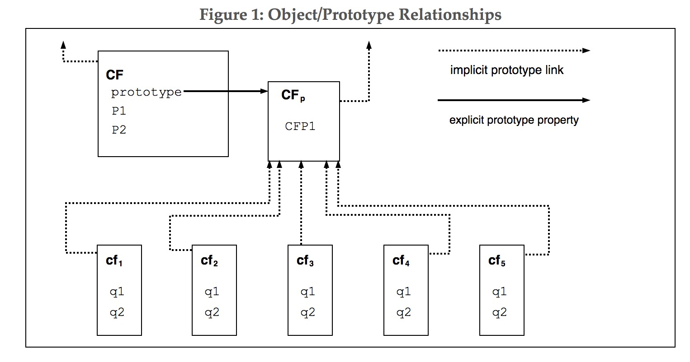

尽管 ECMAScript 包含类定义的语法，但 ECMAScript 对象并非基本上基于类，如 C++、Smalltalk 或 Java 中的类。反之，可以通过各种方式创建对象，包括通过字面量或通过构造函数，然后执行代码初始化给全部或者部分属性分配初始值。每个构造函数都有一个名为“prototype”的属性，用于实现基于原型的继承和共享属性。对象是通过 new 表达式使用构造函数创建的；例如，`new (2009,11)` 创建一个新的日期对象。在不使用 new 的情况下调用构造函数会产生依赖于构造函数的后果。例如，`Date()` 会生成当前日期和时间的字符串表示形式，而不是对象。

由构造函数创建的每个对象都有一个隐式引用（称为对象的原型），以指向其构造函数的“prototype”属性的值。此外，原型可能有一个对其原型的非空隐式引用等等；这被称为原型链。当对对象中的某个属性进行引用时，该引用就是该原型链中包含该名称属性的第一个对象中该名称的属性。换句话说，首先直接提到的对象是检查这样的属性；如果该对象包含指定的属性，那就是引用引用的属性；如果该对象不包含指定的属性，则接下来检查该对象的原型等等。

In a class-based object-oriented language, in general, state is carried by instances, methods are carried by classes, and inheritance is only of structure and behaviour. In ECMAScript, the state and methods are carried by objects, while structure, behaviour, and state are all inherited.

在基于类的面向对象语言中，通常情况下，状态由实例承载，方法由类承载，继承仅限于结构和行为。在 ECMAScript 中，状态和方法挂载在对象上，而结构、行为和状态均被继承。

所有不直接包含其原型包含的特定属性的对象共享该属性及其值。图 1 说明了这一点：

CF 是一个构造函数（也是一个对象）。用 new 表达式创建了 5 个对象：cf1、cf2、cf3、cf4 和 cf5。每一个对象包含名为 q1 和 q2 的属性值。虚线表示隐形的原型依赖；所以，例如 cf3 的原型是 CFp。构造函数 CF 拥有两个自身属性，名为 P1 和 P2，但未出现在 CFp、cf1、cf2、cf3、cf4 或 cf5 中。CFp 中名为 CFP1 的属性由 cf1、cf2、cf3、cf4 和 cf5（但不是由 CF）共享，因为在 CFp 的隐式原型链中找到的任何属性都未命名为 q1、q2 或 CFP1。注意，这不是 CF 和 CF 之间的隐形原型链接。

与大多数基于类的对象语言不同，可以通过为属性分配值来动态地将属性添加到对象中。也就是说，构造函数不需要为所有或任何构造对象的属性命名或赋值。在上图中，可以通过为 CFp 中的属性分配新值来为 cf1，cf2，cf3，cf4 和 cf5 添加新的共享属性。

尽管 ECMAScript 对象本质上不是基于类的，但是基于普通模式的构造函数、原型对象和方法定义类似类的抽象很方便。ECMAScript 内置对象本身遵循类似类的模式。从 ECMAScript 2015 开始，ECMAScript 语言包括语法类定义，允许程序员简洁地定义符合内置对象所使用的类似抽象模式的对象。
